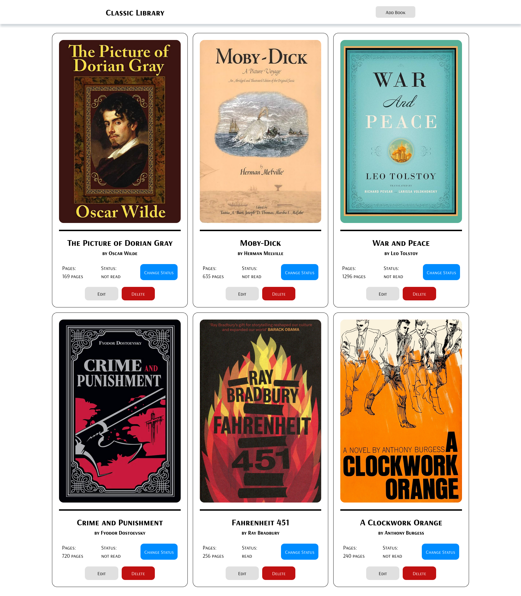

# Library

A library with the basic operation on books, where you can add, remove and edit them.

**Link to project:** https://defalterxd.github.io/Library/

## How It's Made:

**Tech used:** HTML, CSS, JavaScript

This project mainly focus on implementing the functionality for book manipulations via JavaScript. So at first I created a layout and put a book card placeholder as the reference to create and modify it directly in JavaScript. With creating for each individual 'id' identifier.

The other functions which can allows to manipulate with those books was mainly used in 'prototype' as methods. And using event delegation to determine which button was pressed in the process for certain action.

## Optimization:

With form for adding books if the field or all fields is empty then the book would be created with default parameters, which was declared at corresponding function.

And for editing books I add condition for each field wether it's empty or not. So it could apply changes or not depending on that condition.

## Lessons Learned:

In this project I learned:
<ul>
    <li>Creating object via constructor</li>
    <li>Using custom 'id' identifiers</li>
    <li>Using object prototype</li>
    <li>Knowing 'dialog' tag and how to manipulate it</li>
    <li>Utilizing 'closest()' method for selectors</li>
</ul>